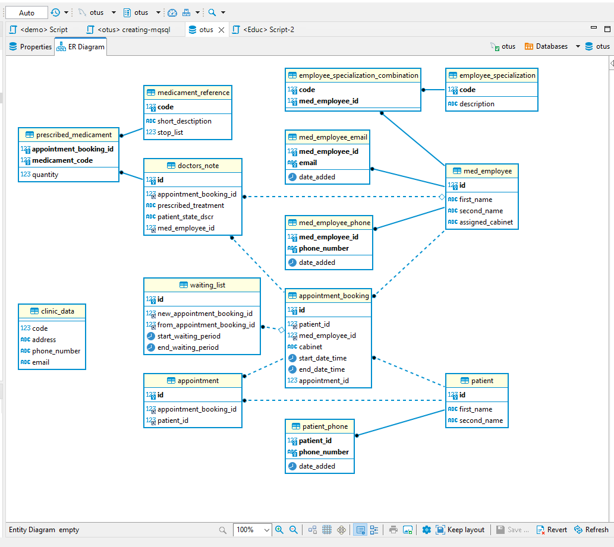
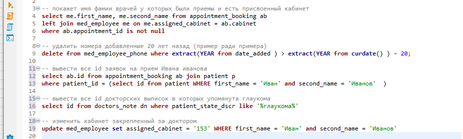

## 11. DML вставка, обновление, удаление, выборка данных

1. Схема БД (mysql подключен из dbeaver)

2. примеры запросов с left join и join и 5 c where :

без результатов т.к. надо честно признаться - БД пока пустое :)