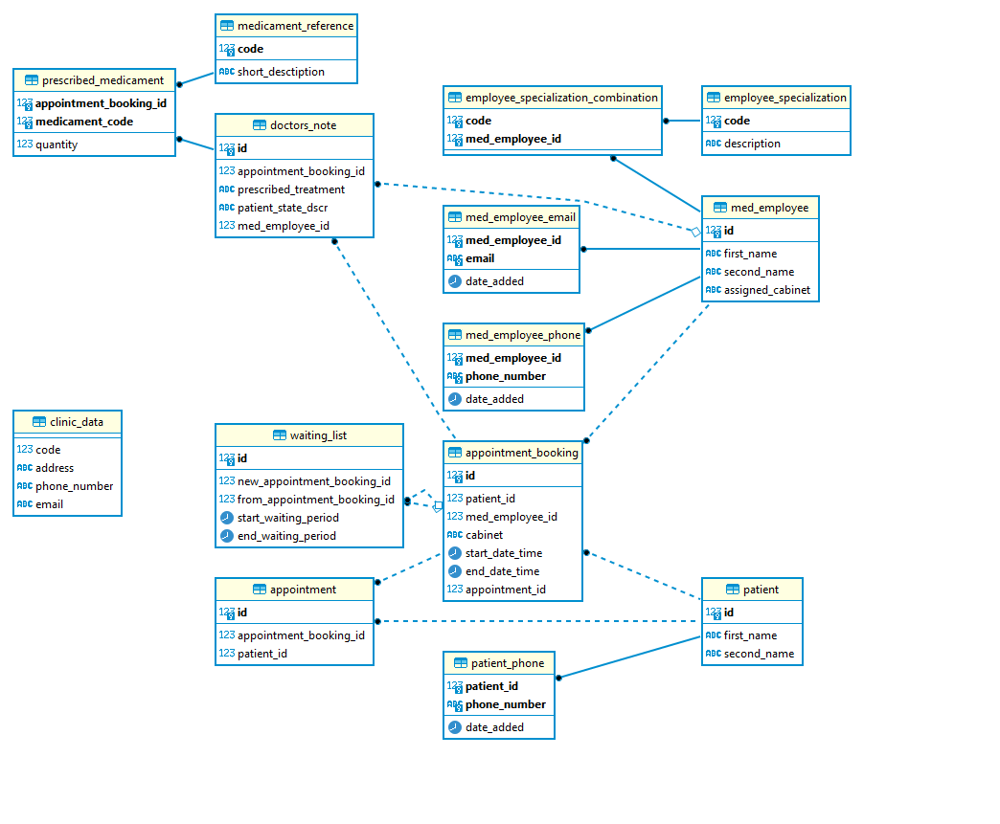
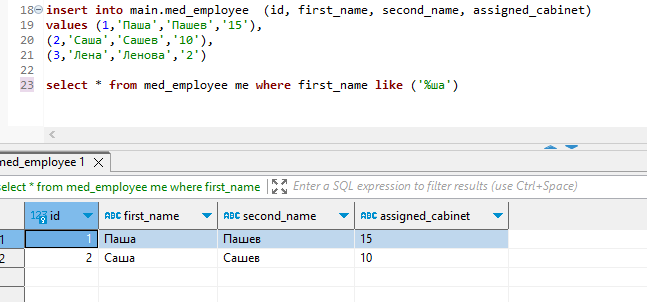
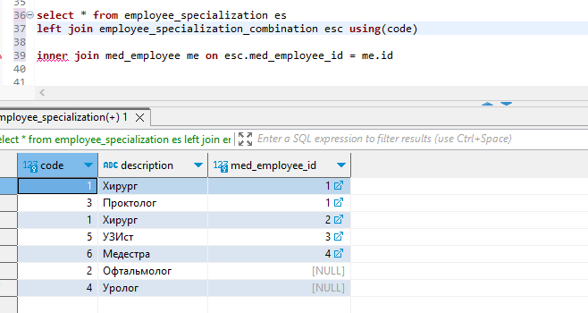
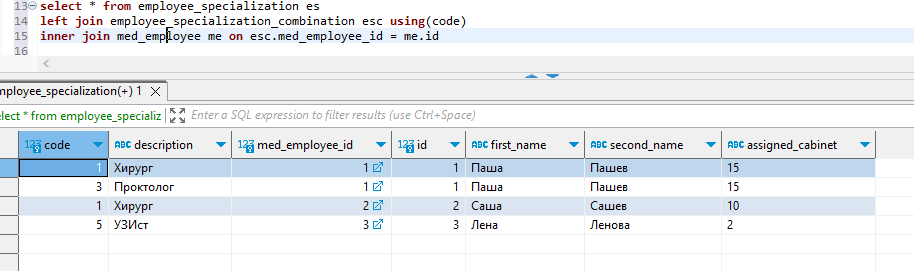
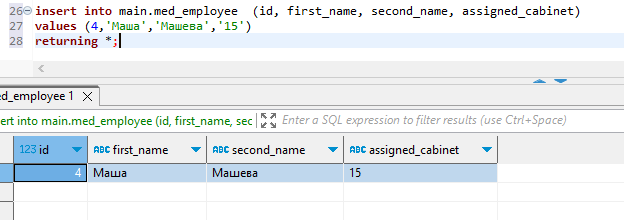
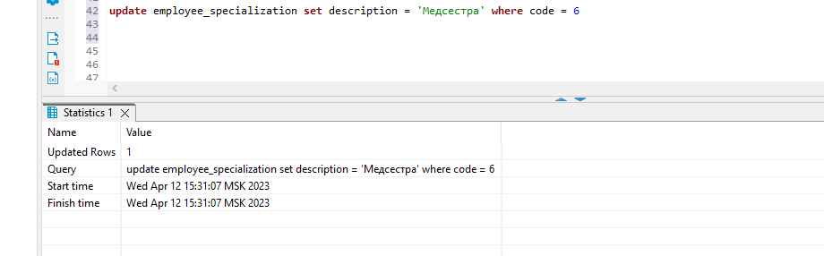
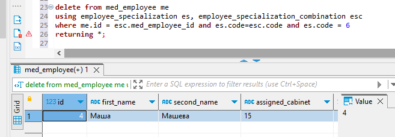

# 5. DML вставка, обновление, удаление, выборка данных

Схема 

1. SELECT с регулярным выражением

Кейс из серии "Не помню имя, помню только последние 2 буквы"

2. Присоединение таблиц с Left и inner join выполняются последовательно. Таким образом, сначала будет выборка по левой таблице, если значение в правой таблице не будет найдено, значения столбцов правой таблицы заполнятся NULL-ами

Если после этого выполнить inner join то в качестве левой таблицы будет выступать результат left join, и выведены будут только строки, которые удовлетворяют условию on в обоих таблицах

3. Запрос на добавление данных с выводом информации о добавленных строках:

4. Запрос с обновлением данные используя UPDATE FROM:

5. Удаление всех медсестер из med_employee (пришлось подкрутить foreign key таблиц med_employee и employee_specialization_combination добавив on delete cascade):

