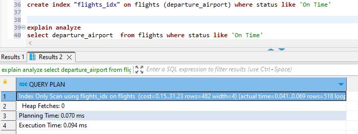

# 6. Индексы Postgresql

Таблица tickets

1. Создать индекс к какой-либо из таблиц вашей БД и прислать explain

Поиск по таблице без индекса

Поиск по таблице с индексом

Видно разницу в Excexution Time, с индексом отработало быстрее

2. Реализовать индекс для полнотекстового поиска

Пытался и на своей и на тестовой postgrespro, но никак не удалось добиться использования Index Scan с GIN по varchar и text полям.

3. Реализовать индекс на часть таблицы или индекс
на поле с функцией

Таблица:

Видно что поиск проходил только по индексу, без захода в таблицу (если я все правильно понял)

4. Создать индекс на несколько полей

Без индекса :

С индексом : 

5. Описать что и как делали и с какими проблемами
столкнулись

Долго не мог понять почему не работают индексы на моих базе. Скорее всего потому что они не работают на таблицах из 10 строк.

Долго возился с GIN, но так и не смог разобраться как заставить его использовать т.к. всегда выполняется Seq Scan

