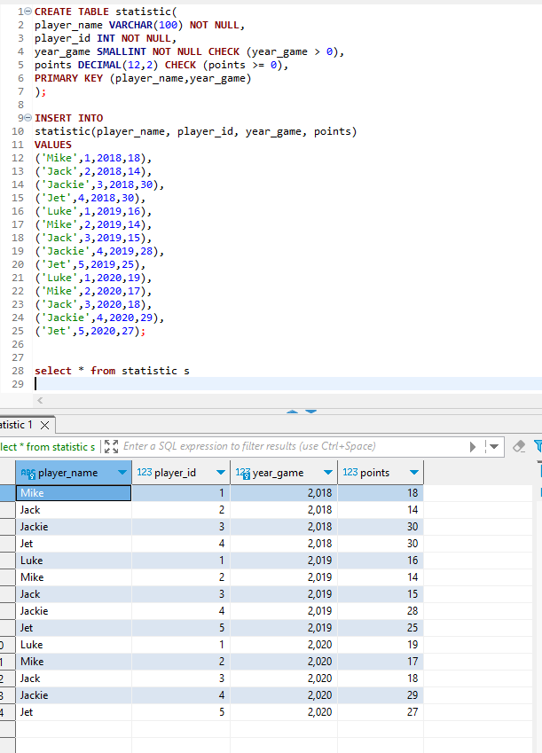
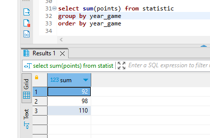
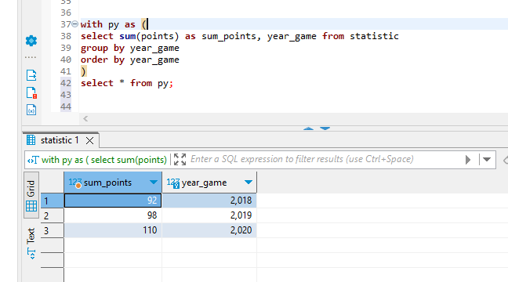
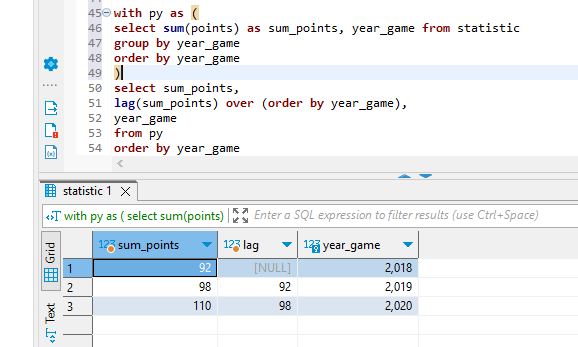

# 7. DML агрегация и сортировка, CTE, аналитические функции

1. Создана таблица :

2. Запрос суммы очков с группировкой и сортировкой по годам

3. cte показывающее тоже самое

4. Используя функцию LAG вывести кол-во очков по всем игрокам за текущий код и за предыдущий

