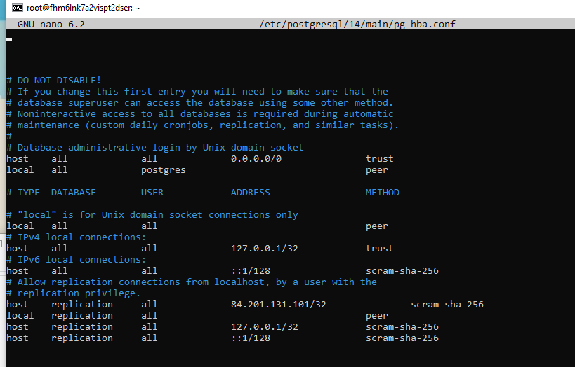
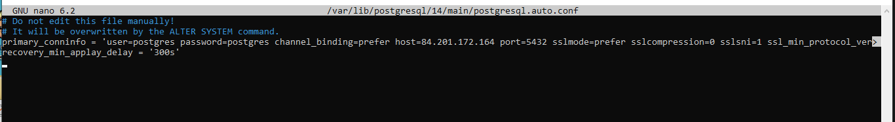
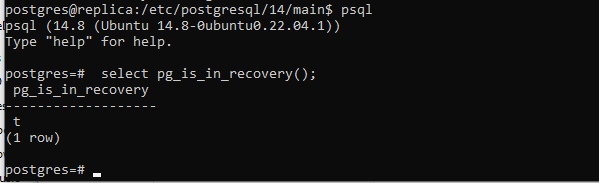
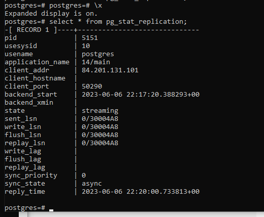
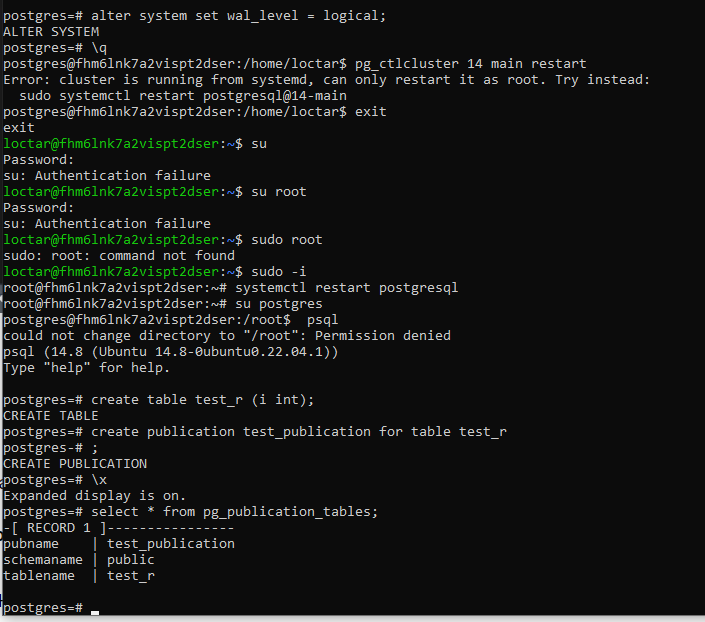
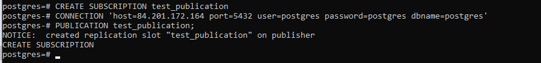

## 8. Репликация

# Физическая

1. Настройка pg_hba хоста :

2. Настройка задержки в 5 минут

3. Выполнение на реплике pg_basebackup

4. pg_is_recovery на реплике

5. pg_replication на хосте

# Логическая

1. Действия на хосте :

2. Создание таблицы на реплике

3. Создание подписки на реплике

